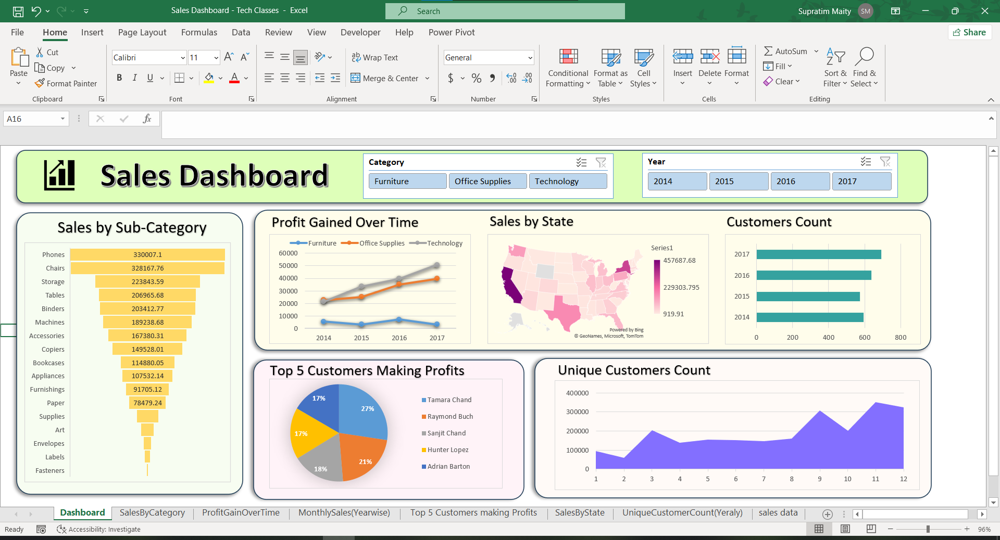

# Sales Dashboard for Business Insights

## Project Overview

This Sales Dashboard is designed to provide a comprehensive overview of sales performance, customer distribution, and profitability trends across different categories, states, and years. Built using Microsoft Excel with Power Pivot, it allows users to gain insights into various aspects of sales data with interactive visualizations.

## Key Features

- **Sales by Sub-Category**: A bar chart ranking sub-categories by total sales, making it easy to identify high-performing products.
- **Profit Gained Over Time**: A line chart comparing profit trends across different categories (Furniture, Office Supplies, and Technology) over several years.
- **Sales by State**: A map visualization showing total sales distribution across U.S. states, highlighting regional performance.
- **Customer Count**: A bar chart displaying the number of unique customers per year, revealing customer base growth.
- **Top 5 Customers Making Profits**: A pie chart indicating the top customers contributing to profits, categorized by customer names.
- **Unique Customers Count**: A line chart showing the monthly trend of unique customers, giving insights into customer engagement patterns.

## Technology Used

- **Microsoft Excel**: Used for data management, visualization, and dashboard creation.
- **Power Pivot**: Enabled advanced data analysis and relationships between data tables.

## How to Use

1. Download and open the Excel file.
2. Use the filters at the top (Category and Year) to dynamically adjust the dashboard views.
3. Explore each visualization to gain insights into sales performance, profit trends, customer distribution, and top-performing customers.
